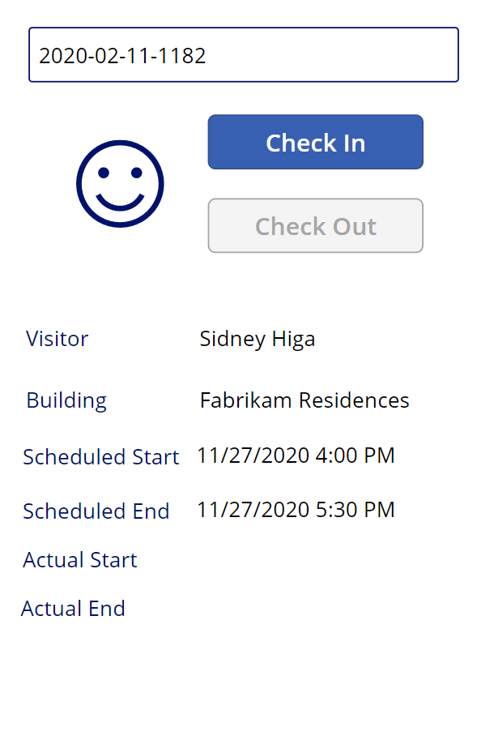

---
lab:
    title: 'Lab 3. Come creare un’app canvas, parte 2'
    module: 'Modulo 3. Introduzione a Power Apps'
---

# Modulo 3. Introduzione a Power Apps
## Lab 2. Come creare un'app canvas, parte 2

# Scenario

Il Bellows College è un'organizzazione didattica con più edifici nel proprio campus. Le visite al campus sono attualmente registrate su documenti cartacei. Le informazioni non vengono acquisite in modo coerente e non esiste un sistema per raccogliere e analizzare i dati sulle visite in tutto il campus. 

L'amministrazione del campus vorrebbe modernizzare il proprio sistema di registrazione dei visitatori, facendo controllare l'accesso agli edifici dal personale addetto alla sicurezza e richiedendo una preregistrazione di tutte le visite da parte degli ospiti.

Durante questo corso verranno sviluppate applicazioni e si useranno le funzionalità di automazione per consentire al personale amministrativo e addetto alla sicurezza del Bellows College di gestire e controllare l'accesso agli edifici del campus. 

Nella parte 2 di questo lab si vedrà come creare, progettare e compilare un'app canvas di Power Apps, che verrà usata dal personale addetto alla sicurezza agli ingressi degli edifici per controllare e registrare velocemente i visitatori.

# Procedura generale per il lab

Verrà usata la sequenza seguente per progettare l'app canvas:

-   Creare l'app con il fattore di forma telefono
-   Connettersi a Dataverse come origine dati
-   Acquisire l'input (codice del visitatore) e trovare la riga del visitatore
-   Configurare un controllo modulo per la visualizzazione delle informazioni sui visitatori
-   Usare una visualizzazione di Dataverse per popolare la raccolta
-   Gestire il processo di check-in e check-out per un visitatore

## Prerequisiti

* Completamento del **lab 0 del modulo 0 - Convalidare l'ambiente lab**
* Completamento del **lab 1 del modulo 2 - Introduzione a Microsoft Dataverse**

## Aspetti da considerare prima di iniziare

-   A quali informazioni deve poter accedere rapidamente il personale addetto alla sicurezza?
-   Cosa succede se il codice del visitatore non è valido?
-   Cosa succede se il visitatore arriva al di fuori delle ore pianificate?

# Esercizio 1. Creare un'app canvas per la sicurezza

**Obiettivo:** in questo esercizio si creerà un'app canvas.

## Attività 1. Creare un'app canvas

1.  Aprire la soluzione Campus Management.

    -   Accedere a <https://make.powerapps.com>

    -   Se l'ambiente visualizzato in alto a destra non è l'ambiente Practice, selezionarlo in **Ambiente**. 

    -   Selezionare **Soluzioni**.

    -   Fare clic per aprire la soluzione **Campus Management**.
    
2.  Creare una nuova applicazione canvas

    -   Fare clic su **Nuovo** e selezionare **App \| App canvas**.

    -   Dalla finestra vuota nell'app canvas, immettere **[Il proprio cognome] Campus Security** nel campo Nome app.

    -   Selezionare **Telefono** nel campo Formato.

    -   Fare clic su **Crea**.
        L'editor di app verrà aperto in una nuova finestra. Fare clic su **Ignora** se viene visualizzata la finestra di dialogo Benvenuto in Power Apps Studio.
    
3.  Salvare l'app canvas

    -   Fare clic su **File** e selezionare **Salva con nome**.
    
    -   Verificare che sia selezionata l'opzione **Cloud** e fare clic su **Salva**.

    -   Verificare il nome di **[Il proprio cognome] Campus Security** e fare clic su **Salva**.
        
    -   Fare clic sulla freccia **Indietro** in alto a sinistra, sotto a Power Apps, per tornare all'app.

3.  Connettersi all'origine dati (Visit)

    -   Fare clic su **Visualizza \| Origini dati.**
    
    -   Fare clic su **+ Aggiungi dati**.

    -   Fare clic su **Visualizza tutte le tabelle**
    
    -   Selezionare **Visit** e attendere che la tabella Visit venga visualizzata nella scheda Dati.
    
4.  Per conservare il lavoro in corso, fare clic su **File** e quindi su **Salva**. Usare la freccia indietro per tornare all'app.

## Attività 2. Visualizzare le informazioni sui visitatori

1.  Aggiungere una casella di ricerca

    -   Selezionare la scheda **Visualizzazione struttura ad albero** nella barra di spostamento a sinistra.
    
    -   Selezionare **Screen1**.
    
    -   Passare alla scheda **Inserisci**.
    
    -   Fare clic su **Testo** e selezionare **Input di testo**.
    
2.  Modificare l'oggetto input di testo

    -   Con l'oggetto Input di testo ancora selezionato, selezionare il testo nella proprietà **Impostazione predefinita** e cancellare il valore.
    
    -   Selezionare la proprietà **Testo suggerimento** e immettere `"Enter visitor code"` come valore, incluse le virgolette doppie.
    
    -   Fare clic su **[...]** accanto al nome del controllo nella visualizzazione struttura ad albero (TextInput1), selezionare **Rinomina** e cambiare il nome in `textCode`.
    
3.  Aggiungere una visualizzazione modulo

    -   Nella scheda **Inserisci** fare clic su **Moduli** e quindi selezionare **Visualizza**. Potrebbe essere necessario fare clic sulla freccia in giù a destra della barra multifunzione per visualizzare Moduli.
   
    -   Trascinare il modulo per posizionarlo e allinearlo alla parte inferiore della schermata.
   
    -   Con il nuovo modulo ancora selezionato, selezionare la proprietà **Origine dati** e selezionare **Visit**.
   
    -   Nel riquadro delle proprietà selezionare **Orizzontale** come **Layout**.

4.  Modificare la visualizzazione modulo

    -   Con il nuovo modulo ancora selezionato fare clic su **Modifica campi**

    -   Rimuovere sia il campo **Name** sia il campo **Data creazione**

    -   Fare clic su **Aggiungi campo** e selezionare i campi seguenti: **Actual End**, **Actual Start**, **Building**, **Scheduled End**, **Scheduled Start**, **Visitor**
   
    -   Fare clic su **Aggiungi**
   
    -   Modificare l'ordine dei campi selezionati trascinando le schede dei campi nell'elenco. L'ordine consigliato è: Visitor, Building, Scheduled Start, Scheduled End, Actual Start, Actual End. È possibile comprimere i campi per facilitarne il trascinamento.
   
    -   Fare clic sulla **X** per chiudere il riquadro Campi
   
5.  Con la visualizzazione modulo ancora selezionata, selezionare la scheda Avanzate nel riquadro delle proprietà. Selezionare la proprietà **Item** e immettere `LookUp(Visits, Code = textCode.Text)` 

6.  Per conservare il lavoro in corso, fare clic su **File** e quindi su **Salva**. Usare la freccia indietro per tornare all'app.

7.  Prepararsi per testare l'app

    -   Passare alla scheda del browser che contiene la soluzione

    -   Fare clic su **Fine** nella finestra popup
   
    -   Selezionare la tabella **Visit**
   
    -   Selezionare la scheda **Dati**
   
    -   Aprire la selezione visualizzazioni in alto a destra facendo clic sul nome della visualizzazione corrente **Visit attivi/e**
   
    -   Passare alla visualizzazione **Tutte le colonne**
   
    -   Individuare una riga della tabella Visit per cui non è disponibile il valore Actual Start o Actual End, ovvero entrambe le colonne sono vuote. Selezionare e copiare il **Code** per questa visita.

8.  Testare l'app

    -   Passare alla scheda del browser con l'app e premere **F5** oppure fare clic sull'icona **Esegui** nell'angolo in alto a destra per visualizzare l'app in anteprima.
   
    -   Incollare il valore copiato nella casella di ricerca e verificare che il record venga visualizzato nel modulo
   
9.  Cancellare il contenuto della casella di ricerca.
   
10.  Premere **ESC** per chiudere l'app in esecuzione.

## Attività 3. Aggiungere i pulsanti per il check-in e il check-out

In questa attività verranno creati i pulsanti per consentire agli utenti di eseguire il check-in e il check-out per la visita. 

1. Salvare i risultati di ricerca in una variabile da riutilizzare nel controllo

    * Selezionare il controllo **textCode**
   
    * Nel riquadro delle proprietà selezionare la scheda **Avanzate** e quindi selezionare la proprietà **OnChange**
   
    * Immettere l'espressione seguente `Set(Visit, LookUp(Visits, Code = textCode.Text))`
    
    > La visita verrà così salvata in una variabile globale quando l'utente esegue una ricerca nella casella di ricerca textCode. In questo modo sarà possibile usare la variabile *Visit* in tutta l'app senza dover immettere di nuovo l'intera espressione di ricerca.

2. Aggiungere il pulsante per il check-in

   * Selezionare la scheda **Inserisci**
   
   * Fare clic su **Pulsante**
   
   * Nel riquadro delle proprietà impostare la proprietà **Testo** del pulsante su "`Check In`" (è possibile digitare all'interno delle virgolette esistenti)
   
   * Fare clic su **[...]** accanto al nome del pulsante nella visualizzazione struttura ad albero (Button1), selezionare **Rinomina** e cambiare il nome in `CheckInButton`

3. Aggiungere il pulsante per il check-out   

   * Fare clic su **Pulsante** nella scheda Inserisci per inserire un altro pulsante
   
   * Nel riquadro delle proprietà impostare la proprietà **Testo** del pulsante su "`Check Out`" (è possibile digitare all'interno delle virgolette esistenti)
   
   * Rinominare il pulsante `CheckOutButton`
   
   * Posizionare i pulsanti sotto la casella di ricerca, con **Check In** sopra **Check Out** 
   
## Attività 4. Abilitare o disabilitare i pulsanti a seconda dei dati sulla visita

Quando gli utenti trovano la visita tramite la casella di ricerca, vogliamo che usino il pulsante Check In per eseguire il check-in. Vogliamo abilitare il pulsante **Check In** quando viene trovato il record della visita (non vuoto), lo stato del record è attivo e la visita non è ancora iniziata, ovvero il valore di inizio effettivo è vuoto.

1. Selezionare **CheckInButton** e fare clic sulla proprietà **Modalità di visualizzazione** del pulsante nella scheda Proprietà

2. Immettere l'espressione seguente nella barra delle funzioni:

      ```
      If(!IsBlank(Visit) 
      && Visit.Status = 'Status (Visits)'.Active
      && IsBlank(Visit.'Actual Start'),
          DisplayMode.Edit,
          DisplayMode.Disabled
      )
      ```

   L'espressione può essere suddivisa e spiegata come segue:

   * **!IsBlank(Visit)** - Il record della visita è stato trovato
   * **&&** - Operatore AND logico
   * **Visit.Status = 'Status (Visits)'.Active** - Lo stato del record è *Active*
   * **IsBlank(Visit.'Actual Start')** - Il campo Active Start non contiene dati
   * **DisplayMode.Edit, DisplayMode.Disabled** - Se le condizioni precedenti risultano soddisfatte, il pulsante diventa modificabile. In caso contrario, il pulsante rimarrà disabilitato.

Vogliamo abilitare il pulsante **Check Out** quando viene trovato il record della visita (non vuoto), lo stato del record è attivo e la visita è già iniziata, ovvero il valore di inizio effettivo non è vuoto.

3. Selezionare il pulsante Check Out e fare clic sulla proprietà **Modalità di visualizzazione** del pulsante nella scheda Proprietà

4. Immettere l'espressione seguente nella barra delle funzioni:

     ```
     If(!IsBlank(Visit) 
     && Visit.Status = 'Status (Visits)'.Active
     && !IsBlank(Visit.'Actual Start'),
         DisplayMode.Edit,
         DisplayMode.Disabled
     )
     ```

5. Per conservare il lavoro in corso, fare clic su **File** e quindi su **Salva**. Usare la freccia indietro per tornare all'app.

6. Premere **F5** per eseguire l'app. 

7. Entrambi i pulsanti devono essere disabilitati. Immettere il valore del codice copiato in precedenza e premere **TAB** per spostare lo stato attivo fuori dalla casella di testo oppure fare clic all'esterno della casella di testo. Il pulsante **Check In** dovrebbe essere abilitato. 

8. Cancellare il contenuto della casella di ricerca.

9. Premere **ESC** per chiudere l'app in esecuzione.

## Attività 5. Completare il processo di check-in e check-out

Per eseguire il processo di check-in e check-out, è necessario aggiornare i dati sulle visite di Dataverse come segue:

* Quando il visitatore esegue il check-in, impostare il campo *Actual Start* sulla data e l'ora correnti
* Quando il visitatore esegue il check-out, impostare il campo *Actual End* sulla data e l'ora correnti. 
* Dopo il check-out, impostare lo stato del record su inattivo, a indicare che la visita è stata completata

1. Selezionare il pulsante **Check In**.

2. Impostare la proprietà **OnSelect** nella scheda Avanzate sull'espressione seguente.

   ```
   Patch(
       Visits,
       Visit,
       {'Actual Start': Now()}
   );
   Refresh([@Visits]);
   Set(Visit, LookUp(Visits, Code = textCode.Text));
   ```

   L'espressione è composta dalle parti seguenti:

   * **Patch(Visits, Visit, {'Actual Start': Now()});**. Il metodo *Patch* aggiorna la tabella **Visit**, la riga identificata dalla variabile **Visit**, ovvero la visita corrente. L'espressione imposta il valore della colonna *Actual Start* sulla data e l'ora correnti (metodo *Now()*).
   * **Refresh([@Visits]);**. Questa espressione aggiorna le righe delle visite, dato che i valori sottostanti sono cambiati
   * **Set(Visit, LookUp(Visits, Code = textCode.Text));** Questa espressione aggiorna la variabile *Visit* con i dati aggiornati da Dataverse.
   
   > Quando un utente fa clic su questo pulsante, il valore Actual Start della visita verrà impostato sulla data e l'ora correnti e i dati verranno aggiornati.

3. Selezionare il pulsante **Check Out**.

4. Impostare la proprietà **OnSelect** nella scheda Avanzate sull'espressione seguente:

   ```
   Patch(
       [@Visits],
       Visit,
       {
           'Actual End': Now(),
           Status: 'Status (Visits)'.Inactive
       }
   );
   Refresh([@Visits]);
   Set(Visit, LookUp(Visits, Code = textCode.Text));
   ```

   Quando un utente fa clic su questo pulsante, il valore Actual End verrà impostato sulla data e l'ora correnti, il valore Status della visita verrà impostato su Inactive e i dati verranno aggiornati.

5. Per conservare il lavoro in corso, fare clic su **File** e quindi su **Salva**. Usare la freccia **Indietro** per tornare all'app.

6. Premere **F5** o fare clic sul pulsante Esegui per eseguire l'app. Immettere il valore del codice copiato in precedenza e premere **TAB** per spostare lo stato attivo fuori dalla casella di testo. Il pulsante **Check In** dovrebbe essere abilitato.

7. Fare clic sul pulsante **Check In**. Le conseguenze dovrebbero essere le seguenti:

   * Il valore **Actual Start** viene impostato sulla data e l'ora correnti
   
   * Il pulsante **Check In** è disabilitato
   
   * Il pulsante **Check Out** è abilitato

8. Fare clic sul pulsante **Check Out**.

   * Il valore **Actual End** viene impostato sulla data e l'ora correnti
   
   * Entrambi i pulsanti sono disabilitati

9. Cancellare il contenuto della casella di ricerca.

10. Premere **ESC** per chiudere l'app in esecuzione.

## Attività 6. Aggiungere indicatori visivi

L'usabilità di un'app per dispositivi mobili migliora in modo significativo fornendo indicatori visivi. In questa attività verrà aggiunta un'icona che indica se per un visitatore è possibile fare il check-in o il check-out.

1. Selezionare la scheda **Inserisci**.

2. Selezionare **Icone \| Aggiungi**. Selezionare un'icona. A questo punto non importa quale icona viene selezionata perché vogliamo che il valore sia dinamico.

3. Ridimensionare l'icona e posizionarla a sinistra dei pulsanti.

4. Nella scheda Avanzate per l'icona selezionare la proprietà **Icon** nella sezione Progettazione e immettere l'espressione seguente:

   ```
   If(
      CheckInButton.DisplayMode = DisplayMode.Disabled 
   && CheckOutButton.DisplayMode = DisplayMode.Disabled,
       Icon.EmojiFrown,
       Icon.EmojiSmile
   )
   ```

5. Per conservare il lavoro in corso, fare clic su **File** e quindi su **Salva**. Usare la freccia **Indietro** per tornare all'app.

6. Premere **F5** per eseguire l'app. Immettere il valore del codice copiato in precedenza e premere **TAB** per spostare lo stato attivo fuori dalla casella di testo. Verificare che l'icona visualizzi un emoji di faccia imbronciata.

7. Trovare un valore di codice diverso non usato in precedenza, che non abbia un valore Actual Start o Actual End. 

    > È possibile tornare alla scheda precedente per copiare un altro codice da una delle visite create. È anche possibile eseguire l'app **Campus Staff** creata in precedenza per creare nuovi record di visite. Verificare che l'icona visualizzi un emoji di faccia sorridente per questo codice.

L'app in esecuzione dovrebbe essere simile alla seguente:



8. Premere **ESC** per chiudere l'app in esecuzione.

## Attività 7. Pubblicare l'app

1. L'app Campus Security dovrebbe essere ancora aperta nel browser. In caso contrario, selezionare l'app **Campus Security** e fare clic su **Modifica**.

2. Selezionare **File \| Pubblica.** 

3. Selezionare **Pubblica questa versione**.

# Sfide

* Evitare l'immissione manuale del codice della visita
* Aggiungere la convalida dell'edificio per la visita
* Aggiungere la convalida dell'ora effettiva della visita rispetto all'ora pianificata (in anticipo, in ritardo e così via)
* Aggiungere lo stato dettagliato della visita, ad esempio visualizzazione dell'indirizzo e-mail e convalida per il visitatore, motivo dell'accesso negato all'edificio e così via
* Più edifici/riunioni/check-in durante una singola visita al campus. Ad esempio, qualcuno potrebbe visitare il campus per una giornata e durante tale giornata incontrare membri dello staff in più edifici in orari diversi. Si potrebbe considerare di introdurre l'entità *appuntamento* nella soluzione?
