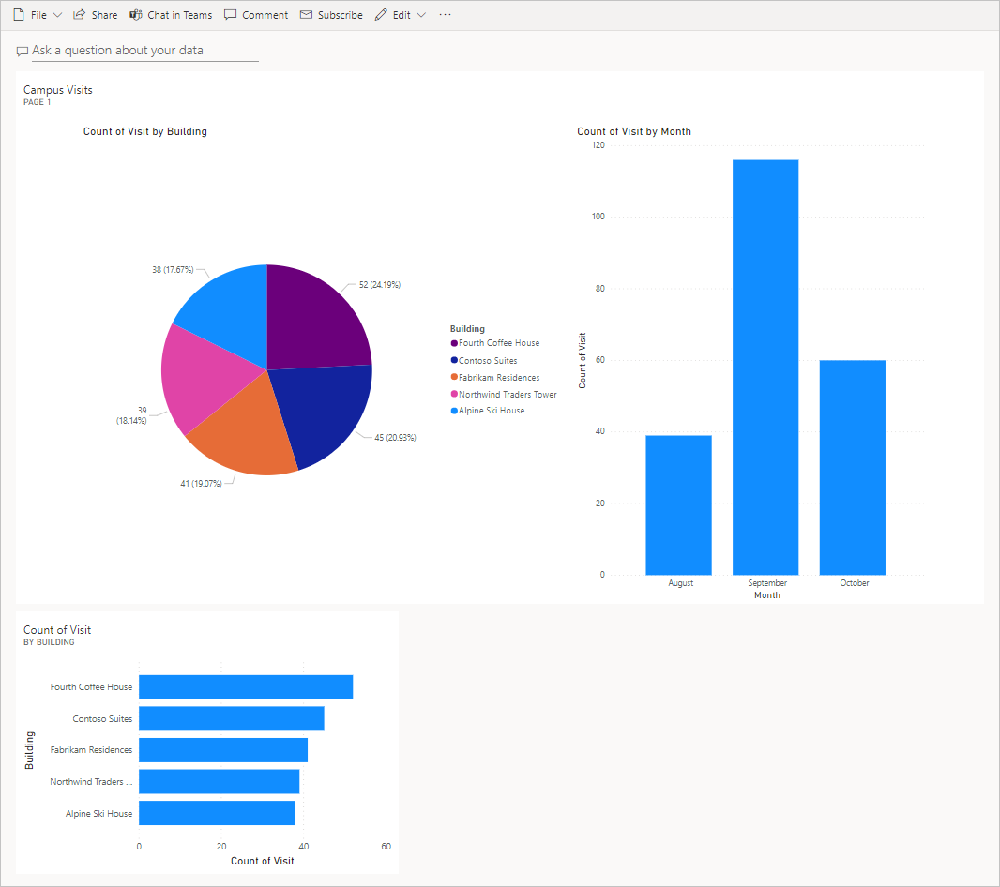

---
lab:
    title: 'Lab 7: Come creare un semplice dashboard'
    module: 'Modulo 5: Introduzione a Power BI'
---

# Modulo 5: Introduzione a Power BI
## Lab: Come creare un semplice dashboard

# Scenario

Il Bellows College è un'organizzazione didattica con più edifici nel proprio campus. I visitatori del campus sono attualmente registrati su documenti cartacei. Le informazioni non vengono acquisite in modo coerente e non esiste un sistema per raccogliere e analizzare i dati sulle visite in tutto il campus. 

L'amministrazione del campus vorrebbe modernizzare il proprio sistema di registrazione dei visitatori, facendo controllare l'accesso agli edifici dal personale addetto alla sicurezza e richiedendo una preregistrazione di tutte le visite da parte degli ospiti.

Durante questo corso verranno sviluppate applicazioni e si useranno le funzionalità di automazione per consentire al personale amministrativo e addetto alla sicurezza del Bellows College di gestire e controllare l'accesso agli edifici del campus. 

In questo lab verrà creato un dashboard di Power BI per la visualizzazione dei dati sulle visite al campus.

# Procedura generale per il lab

Verranno eseguite le procedure seguenti per progettare e creare il dashboard di Power BI:

-   Connettersi a Dataverse
-   Trasformare i dati per includere descrizioni accessibili per le righe correlate (ricerche)
-   Creare e pubblicare un report con varie visualizzazioni delle informazioni sulle visite al campus
-   Usare una query in linguaggio naturale per creare ulteriori visualizzazioni
-   Creare una visualizzazione per dispositivi mobili del dashboard di Power BI


## Prerequisiti

* Completamento del **lab 0 del modulo 0 - Convalidare l'ambiente lab**
* Completamento del **lab 1 del modulo 2 - Introduzione a Microsoft Dataverse**

## Aspetti da considerare prima di iniziare

-   Chi sono i destinatari del report?
-   In che modo i destinatari useranno il report? Dispositivo tipico? Posizione?
-   Sono disponibili dati sufficienti per la visualizzazione?
-   Quali sono le possibili caratteristiche che è possibile usare per analizzare i dati sulle visite?

# Esercizio 1. Creare il report di Power BI 

**Obiettivo:** in questo esercizio si creerà un report di Power BI in base ai dati dal database Dataverse.

## Attività 1. Installare Power BI Desktop / Preparare il servizio Power BI

1. Seguire le istruzioni seguenti per installare Power BI: 

    - Se Power BI Desktop è **già** installato passare all'[Attività 2](#task-2-prepare-data).
    
    - Se Power BI Desktop non è installato, eseguire il **Passaggio 2**.
    
    - Se non sono disponibili le autorizzazioni necessarie o si riscontrano problemi durante l'esecuzione di Power BI Desktop, procedere al **Passaggio 4**.

2. Passare a [https://aka.ms/pbidesktopstore](https://aka.ms/pbidesktopstore) per scaricare e installare Power BI Desktop.

    > [!IMPORTANTE]
    > Se si riscontrano problemi durante l'installazione di Power BI Desktop da Microsoft Store, provare il programma di installazione autonomo che può essere scaricato da [https://aka.ms/pbiSingleInstaller](https://aka.ms/pbiSingleInstaller).

3. Se Power BI Desktop è stato installato correttamente, è possibile passare all'[Attività 2](#task-2-prepare-data). In caso contrario, procedere con il passaggio successivo.

    > Se non sono disponibili le autorizzazioni necessarie per l'installazione di applicazioni desktop o si riscontrano problemi con l'esecuzione o la configurazione di Power BI Desktop, eseguire i passaggi seguenti.

4. Scaricare [visits.pbix](../../Allfiles/visits.pbix) e salvarlo nel computer.

5. Passare a [https://app.powerbi.com/](https://app.powerbi.com/) e fare clic su **Accedi**. 

6. Fare clic su **Area di lavoro personale**. 

7. Se viene presentata la pagina **Recupera dati** fare clic su **Ignora**. 

8. Espandere **+Nuovo** e selezionare **Carica un file**.

    > [!IMPORTANTE]
    > Se l'opzione **+Nuovo** non è disponibile potrebbe essere necessario attivare il nuovo aspetto di Power BI. Assicurarsi di impostare l'interruttore **Nuovo aspetto** su **Attiva** nella parte superiore della schermata.

9. Selezionare **File locale**.

10. Trovare e selezionare il file **visits.pbix** scaricato in precedenza.

11. Al termine del caricamento dei dati selezionare il report **visits** e notare che il tipo è impostato su **Report**.

12. Fare clic su **Modifica**. Se il menu **Modifica** non è visibile fare clic su **...** e quindi selezionare **Modifica**.

13. Il servizio Power BI è stato così configurato per l'uso nei lab. Continuare con l'[Attività 3](#task-3-create-chart-and-time-visualizations), ma usare il servizio Power BI online all'indirizzo [https://app.powerbi.com](https://app.powerbi.com) invece di Power BI Desktop per tutto il lab.

## Attività 2. Preparare i dati

1.  Trovare l'URL dell'organizzazione

    * In una nuova scheda passare all'interfaccia di amministrazione di Power Platform all'indirizzo <https://admin.powerplatform.com>
    
    * Nel riquadro di spostamento a sinistra selezionare Ambienti e quindi aprire l'ambiente Practice.
    
    * Fare clic con il pulsante destro del mouse su **URL ambiente** nel pannello **Dettagli** e quindi scegliere **Copia indirizzo link**.
    
2. Aprire Power BI Desktop e accedere con le proprie credenziali se richiesto.

3. Selezionare **Recupera dati** e quindi selezionare **Altro...**.

4. Selezionare **Power Platform** a sinistra, quindi selezionare **Common Data Service (Legacy)** e fare clic su **Connetti**. Se richiesto, accedere con le proprie credenziali e fare clic su **Connetti**.

5. Incollare l'URL dell'ambiente copiato in precedenza nel campo **URL server** e quindi fare clic su **OK**.

6. Espandere il nodo **Entità** selezionare le entità **bc_Building** e **bc_Visit**, quindi fare clic su **Carica**.

7. Fare clic sull'icona **Modello** sulla barra degli strumenti verticale a sinistra.

8. Trascinare la colonna **bc_buildingid** dalla tabella **bc_Building** e rilasciarla sulla colonna **bc_building** nella tabella **bc_Visit**. Verrà così creata una relazione tra le due tabelle che potrà essere usata da Power BI per visualizzare i dati correlati.

9. Selezionare l'icona **Report** sulla barra degli strumenti verticale a sinistra.

10. Espandere il nodo **bc_Visit** nel pannello **Campi**.

11. Fare clic su **...** accanto a **bc_Visit** e selezionare **Nuova colonna**.

12. Completare la formula come segue:

    ```
    Column = RELATED(bc_Building[bc_name])
    ```

    e premere INVIO. Verrà così aggiunto un nuovo campo con il nome dell'edificio nei dati sulle visite.

13. Fare clic su **...** accanto al campo **Colonna** appena creato e selezionare **Rinomina**. Immettere **Building** come nome di campo.

14. Fare clic su **...** accanto al campo **bc_visitid** e selezionare **Rinomina**. Immettere **Visit** come nome di campo.

15. Fare clic su **...** accanto al campo **bc_scheduledstart** e selezionare **Rinomina**. Immettere **Start** come nome di campo.

16. Salvare il lavoro in corso facendo clic su **File \| Salva** e immettendo un nome di file a scelta.

## Attività 3. Creare le visualizzazioni grafiche per le visite e le informazioni temporali

1. Selezionare l'icona del grafico a torta nel pannello **Visualizzazioni** per inserire un grafico.

2. Trascinare il campo **Building** nella casella **Legenda**.

3. Trascinare il campo **Visit** nella casella **Valori**.

4. Ridimensionare il grafico a torta usando i punti di controllo in angolo in modo che siano visibili tutti i componenti del grafico.

5. Fare clic sul report all'esterno del grafico a torta per deselezionarlo e selezionare l'istogramma a colonne in pila nel riquadro **Visualizzazioni**. 

6. Trascinare il campo **Visit** nella casella **Valori**.

7. Trascinare il campo **Start** nella casella **Asse**.

8. Nel riquadro Visualizzazioni fare clic sulla **x** accanto a **Day** e **Quarter** per lasciare solo i totali di **Year** e **Month** per l'asse.

9. Ridimensionare il grafico nel modo preferito con i punti di controllo in angolo.

10. Testare il report in modo interattivo:

    * Selezionare le varie fette degli edifici nel grafico a torta e osservare le modifiche nel report temporale.
    
    * Fare clic sull'istogramma. Fare clic sulla freccia rivolta verso il basso per attivare la modalità **Drill-down** e quindi fare clic sulla colonna per eseguire il drill-down al livello successivo, ovvero i mesi. Per eseguire questa operazione, è anche possibile fare clic su **Dati/Drill \| Espandi il livello successivo** sulla barra multifunzione.
    
    * Eseguire il drill-up e il drill-down e selezionare varie barre nell'istogramma temporale per osservare le modifiche nel grafico a torta.
    
11. Salvare il lavoro in corso facendo clic su **File \| Salva**.

# Esercizio 2. Creare il dashboard di Power BI

## Attività 1. Pubblicare il report di Power BI

1. Fare clic sul pulsante **Pubblica** nella scheda Home della barra multifunzione.

2. Selezionare **Area di lavoro personale** come destinazione e quindi fare clic su **Seleziona**.

3. Attendere il completamento della pubblicazione e fare clic su **Apri \<nome del report\>.pbix in Power BI**.

## Attività 2. Creare il dashboard di Power BI

1. Il report dovrebbe essere ancora aperto dall'attività precedente.

2. Selezionare **Aggiungi a un dashboard** nel menu. A seconda del layout potrebbe essere necessario fare clic su **...** per visualizzare altre voci di menu.

3. Selezionare **Nuovo dashboard** nel prompt **Aggiungi a dashboard**.

4. Immettere **[cognome] Campus Management** come **Nome dashboard** e fare clic su **Aggiungi oggetto dinamico**.

5. Selezionare **Area di lavoro personale** in alto e selezionare il dashboard **[cognome] Campus Management**.

6. Testare l'interattività del grafico a torta e dell'istogramma visualizzati.

## Attività 3. Aggiungere visualizzazioni in linguaggio naturale

1. Nel dashboard **Campus Management** selezionare la barra **Porre una domanda sui dati** in alto.

2. Immettere **buildings by number of visits** nell'area Domande e risposte. Verrà visualizzato il grafico a barre.

3. Selezionare **Aggiungi oggetti visivo**.

4. Selezionare **Dashboard esistente**, selezionare il dashboard **[cognome] Campus Management** e fare clic su **Aggiungi**.

5. Fare clic su **Chiudi Domande e risposte**.

Dovrebbe essere visualizzato il dashboard **[cognome] Campus Management**. Potrebbe essere necessario scorrere verso il basso per vedere il nuovo oggetto visivo Domande e risposte. 

Il dashboard dovrebbe essere simile al seguente:



## Attività 4 Creare una visualizzazione per dispositivi mobili e condividere un report con un codice a matrice

1. Nel dashboard selezionare **Modifica \| Layout per dispositivi mobili**.

2. Disporre i riquadri nel modo preferito.

3. Fare clic su **Layout per dispositivi mobili** in alto a destra e cambiare visualizzazione selezionando **Layout Web**.

4. Selezionare **Area di lavoro personale** in alto e selezionare il **report**.

5. Selezionare **Modifica** e quindi selezionare **... \| Genera un codice a matrice**.

6. *Facoltativo:* se è disponibile un dispositivo mobile, eseguire la scansione del codice con un'app apposita disponibile per entrambe le piattaforme iOS e Android oppure con l'app della fotocamera se supportato dal telefono in uso. Accedere al proprio account se richiesto. Esplorare il report in un dispositivo mobile.

# Sfide

* Dashboard e report che includono i piani del campus e degli edifici
* Creare report e analizzare i modelli e le tendenze delle visite
* Visualizzazione per le visite prolungate
* Power BI in streaming per l'elaborazione quasi in tempo reale per un campus di grandi dimensioni 
